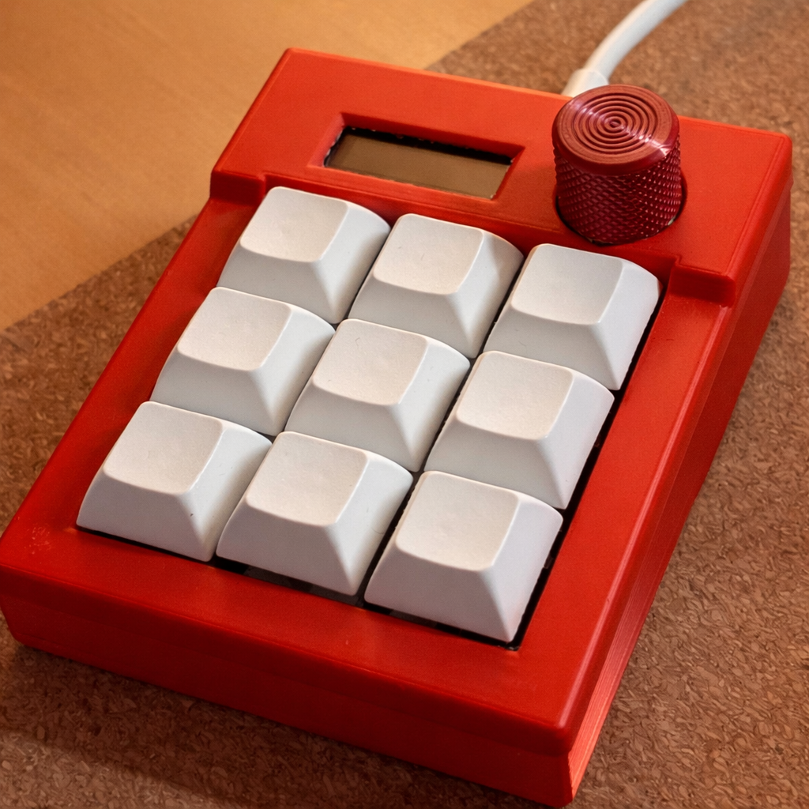
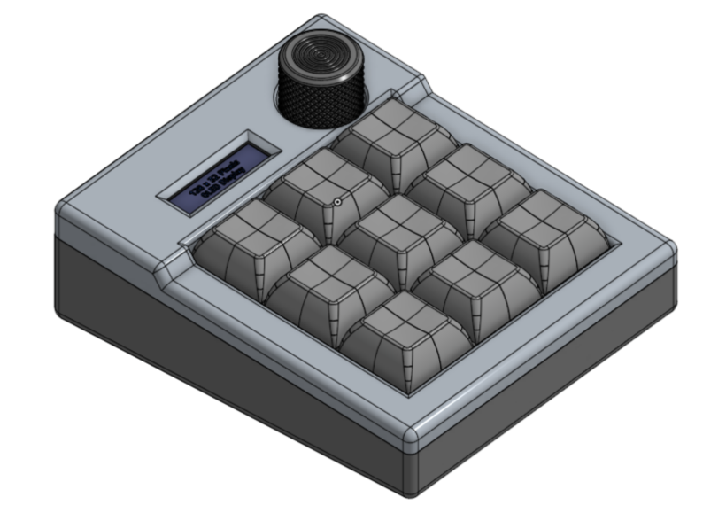
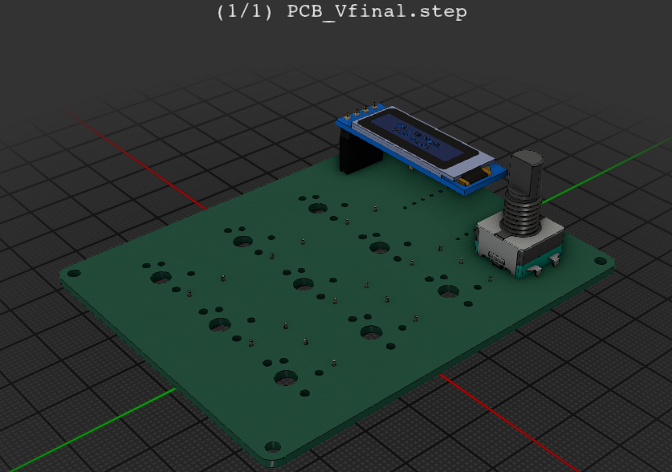
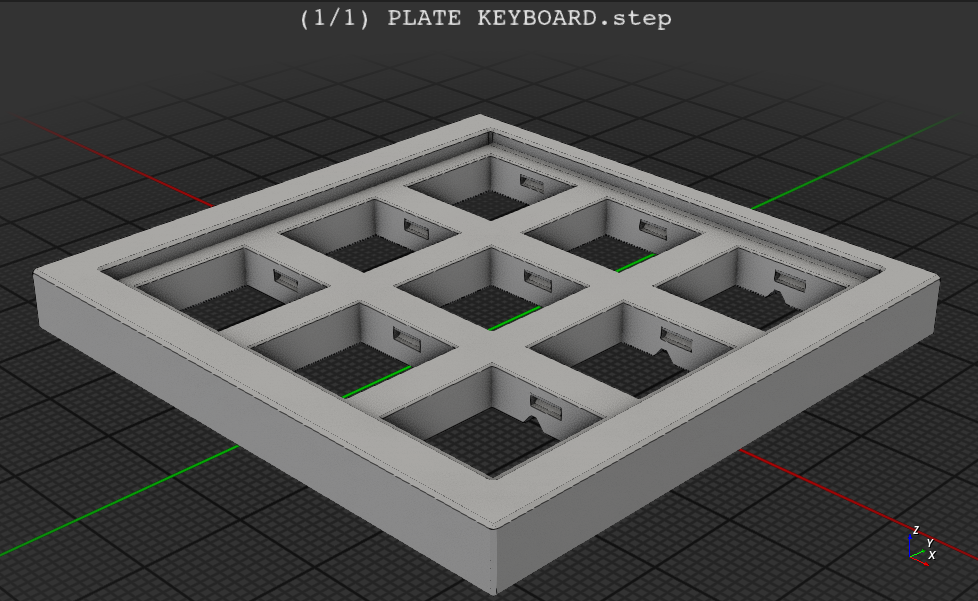
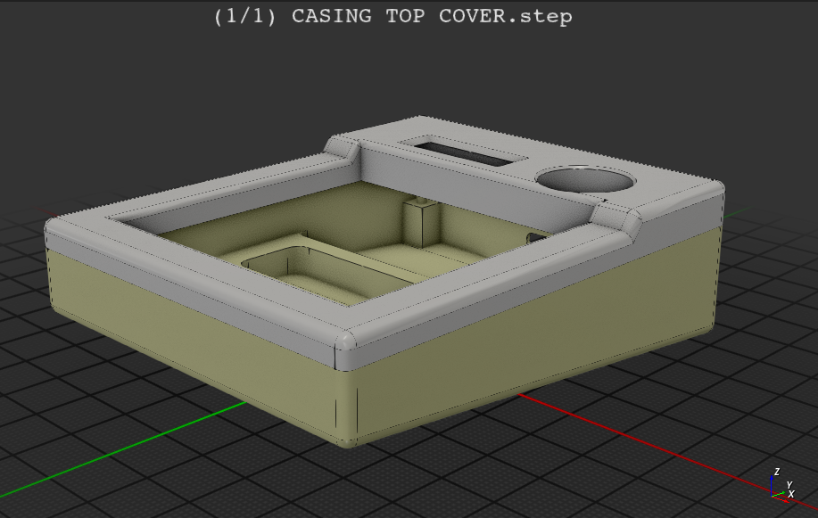
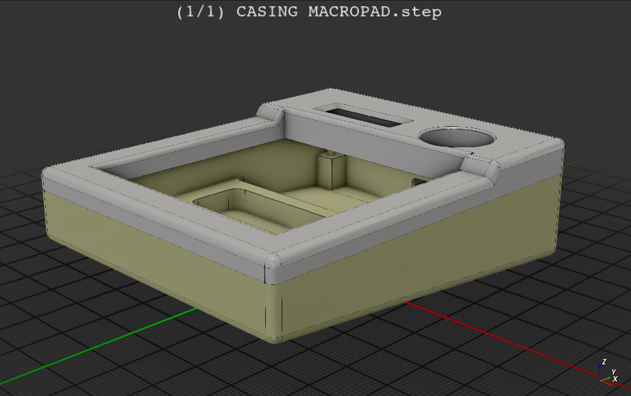
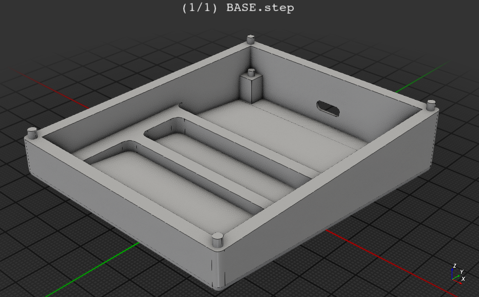

# MackPad — All-in-One Macro Controller  
### By Sivansh Gupta  

---

##  Overview  
**MackPad** is a compact, high-efficiency macropad built to maximize functionality within minimal hardware constraints. Powered by the **Seeeduino XIAO ESP32-S3**, it leverages nearly every available GPIO pin to deliver a rich, customizable user experience.

Designed for **developers, creators, and productivity enthusiasts**, MackPad combines tactile input, visual feedback, and programmable workflows into a single portable device.

---

##  Project Showcase  

### Full Assembly (PCB + Case)

### PCB Design  

### Different Components  

##  Key Features  

- 3×3 NKRO Mechanical Keypad  
- Rotary Encoder with Push Functionality  
- 0.91" OLED Display (Real-time UI Feedback)  
- Neopixel RGB Backlighting  
- Hot-swappable Switch Support  
- Fully Programmable via KMK Firmware  
- Compact and Efficient Embedded Design  

---

##  Motivation  

MackPad began as a simple rotary encoder-based volume controller. It evolved into a fully-featured macropad focused on:

- Speeding up workflows  
- Reducing repetitive actions  
- Providing intuitive visual feedback  
- Maximizing functionality within hardware constraints  

---

##  Hardware Architecture  

- **Microcontroller:** Seeeduino XIAO ESP32-S3  
- **Input System:** 3×3 matrix with diodes (NKRO support)  
- **Rotary Encoder:** Analog-based custom decoding  
- **Display:** SSD1306 OLED (I2C, 128×32)  
- **Lighting:** WS2812 Neopixels  
- **Switches:** MX-style (hot-swappable with Kailh sockets)  

---

##  Firmware  

- Built using **KMK Firmware (CircuitPython)**  
- Features include:  
  - Custom keymaps and macros  
  - OLED UI (layer status, icons, system info)  
  - Rotary encoder multi-function control  
  - Neopixel-based visual feedback  
  - Custom key objects and advanced macro handling  

---

##  Usage  

### Setup  

1. Flash CircuitPython firmware onto the XIAO ESP32-S3  
2. Copy the following to the device:  
   - `code.py`  
   - Required KMK libraries  
   - Display assets (icons/images)  
3. Reboot the device  

---

### Customization  

All customization is handled inside `code.py`:

- Key mappings  
- Macros and shortcuts  
- RGB lighting behavior  
- OLED display output  

---

##  Bill of Materials (BOM)  

| Qty | Component                     | Notes               | USD   | INR   |
|-----|------------------------------|---------------------|-------|-------|
| 1   | Seeeduino XIAO ESP32-S3      | Microcontroller     | $6.00 | ₹500  |
| 9   | MX-style switches            | Mechanical switches | $4.50 | ₹375  |
| 9   | 1N4148 diodes                | Matrix diodes       | $0.90 | ₹75   |
| 1   | SSD1306 OLED (0.91", 128x32) | Display             | $3.00 | ₹250  |
| 9   | DSA keycaps                  | Keycaps             | $5.00 | ₹400  |
| 1   | Female header (1x4)          | Display mount       | $0.50 | ₹40   |
| 1   | EC11 rotary encoder          | Input control       | $1.50 | ₹120  |
| 3   | Resistors (10k, 47k, 100k)   | Voltage divider     | $0.30 | ₹30   |
| 9   | Kailh hot-swap sockets       | Switch mounting     | $6.00 | ₹500  |

### Estimated Total  
- **USD:** ~$27.70  
- **INR:** ~₹2,290  

*Prices may vary depending on supplier.*

---

##  Future Improvements  

### Advanced RGB System  
- Per-key RGB lighting  
- Layer-based color profiles  
- Reactive lighting effects  

### Touch Input Integration  
- Capacitive touch gestures  
- Swipe and tap controls  
- Hybrid input system  

### Wireless Capability  
- Bluetooth connectivity  
- Battery-powered operation  

### Enhanced UI  
- Animated OLED interface  
- Menu-based navigation  
- Dynamic macro previews  

---

##  Project Highlights  

- Efficient use of limited GPIO resources  
- Custom analog decoding for rotary encoder  
- Integration of hardware + firmware + UI design  
- Fully functional productivity tool  

---

### Custom Python-Based Companion Software (Steam Deck Integration)

- Development of a dedicated Python-based companion application designed to run alongside MackPad  
- Enables deep integration with devices like the Steam Deck or PC environments for advanced task execution  
- Supports bidirectional communication between MackPad and the host system (e.g., via Bluetooth/Wi-Fi/USB)  
- Allows dynamic macro triggering based on system context (active app, game state, or workflow)  
- Provides a customizable UI/dashboard for real-time control, monitoring, and macro management  
- Transforms MackPad from a standalone macropad into a hybrid hardware-software control system  
- Unlocks capabilities beyond traditional hackpads, including system-level automation, scripting, and adaptive workflows  

---

##  License  

This project is open-source and available under the MIT License.

---

##  Acknowledgements  

- KMK Firmware Community  
- Good people of Hack Club
